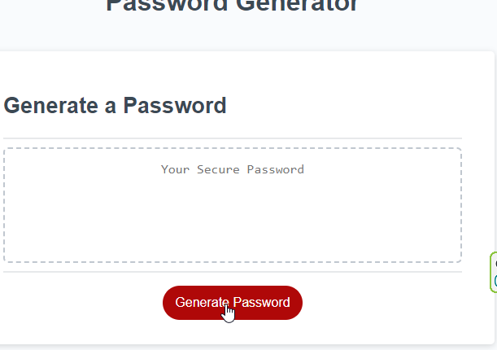
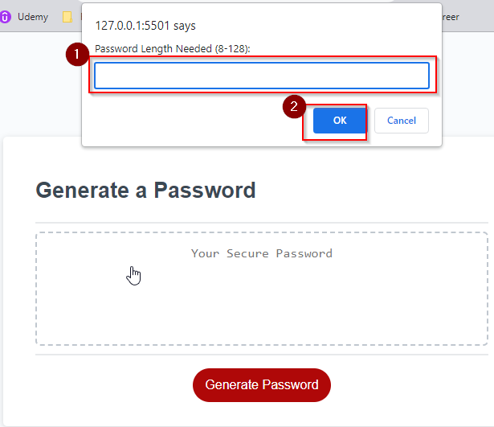
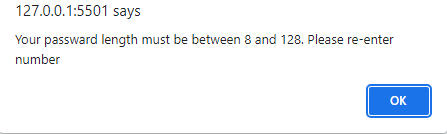
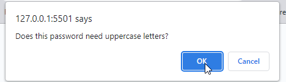
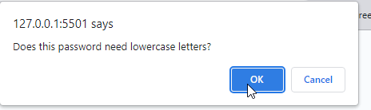
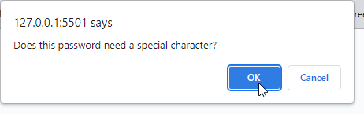
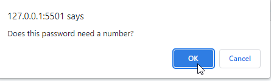
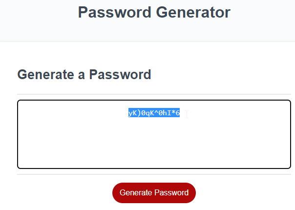

# Professional Portfolio | 02 Weekly Challenge

## Description

This password generating application allows user to easily create random passwords. Once the "Generate Password" button is selected users are prompted to enter the password criteria shown below:
    * Password Length
    * Uppercase Requirements
    * Lowercase Requirements
    * Numeric Requirements
    * Special Characters Requirement

Once all criteria has been entered, the password is then written to the page for users to easily copy and paste it.

During the process of this assignment I learned how to work with built-in objects and their methods.

This webpage has been deployed at: https://shockeyj9.github.io/Password-Generator/

## Installation

N/A

## Usage

This application uses a large red "Generate Password" button to start the process.

Once the button is clicked the user is prompted to enter a number between 8 and 128:

If the user does not enter a number outside of the specified range, they will be provided the following prompt:

After the user enters a valid number they are then prompted to indicate what their passward criteria is.

The password is then written to the screen where users are able to copy and paste it.

## Credits

N/A

## License

Please refer to the LICENSE in the repo.

